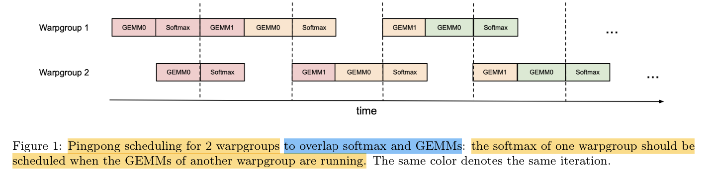
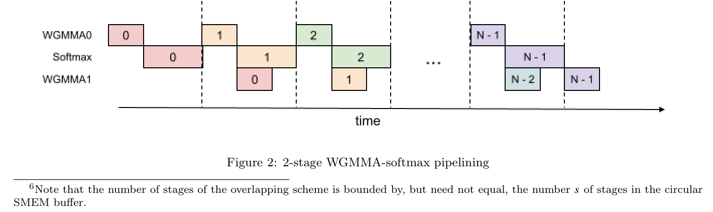

### FlashAttention-3

AlgorithmIn this section, we describe the FlashAttention-3 algorithm. For simplicity, we focus on the forward pass, withthe backward pass algorithm described in Appendix B.1. We first indicate how to integrate warp-specialization witha circular SMEM buffer into the base algorithm of FlashAttention-2. We then explain how to exploit asynchronyof WGMMA to define an overlapped GEMM-softmax 2-stage pipeline. Finally, we describe the modifications neededfor FP8, both in terms of layout conformance and accuracy via block quantization and incoherent processing.

### Producer-Consumer asynchrony through warp-specialization and pingpong scheduling

#### Warp-specialization 
As with FlashAttention-2, the forward pass of FlashAttention-3 is embarrassinglyparallel in the batch size, number of heads, and query sequence length. Thus, it will suffice to give a CTA-levelview of the algorithm, which operates on a tile Q𝑖of the query matrix to compute the corresponding tile O𝑖of theoutput. To simplify the description, we first give the warp-specialization scheme with a circular SMEM buffer thatdoes not have in addition the GEMM-softmax overlapping. Let 𝑑be the head dimension, 𝑁the sequence length,and fix a query block size 𝐵𝑟to divide Q into 𝑇𝑟= ⌈𝑁𝐵𝑟⌉blocks Q1, .., Q𝑇𝑟.

For our implementation of Algorithm 1 on Hopper, we use setmaxnreg for (de)allocations, TMA for loads of Q𝑖and {K 𝑗, V 𝑗}0≤𝑗<𝑇𝑐, and WGMMA to execute the GEMMs in the consumer mainloop, with the SS or RS prefixindicating whether the first operand is sourced from shared memory or register file. For interpreting the executionflow of Algorithm 1, note that issuing TMA loads does not stall on the completion of other loads due to asynchrony.Moreover, in the producer mainloop, no waits will be issued for the first 𝑠iterations as the buffer gets filled.

#### Pingpong scheduling
The asynchronous nature of WGMMA and TMA, along with warp-specialization, opensup the opportunity to overlap the softmax computation of one warpgroup with the GEMM of another warpgroup.To motivate this, notice that non-matmul operations have much lower throughput than matmul operations onmodern hardware accelerators. As an example, the H100 SXM5 GPU has 989 TFLOPS of FP16 matmul but only3.9 TFLOPS of special functions such as exponential5 (necessary for softmax). For the attention forward pass inFP16 with head dimension 128, there are 512x more matmul FLOPS compared to exponential operations, butthe exponential has 256x lower throughput, so exponential can take 50% of the cycle compared to matmul. Thesituation is even worse with FP8, where the matmul throughput doubles but the exponential throughput stays thesame.

Since the exponential is performed by a separate hardware unit (the multi-function unit), ideally we'd wantthe exponential calculation to be scheduled when the Tensor Cores are performing the matmul. To do so, we usesynchronization barriers (bar.sync instructions) to force the GEMMs (GEMM1 – PV of one iteration, and GEMM0– QK⊤of the next iteration) of warpgroup 1 to be scheduled before the GEMMs of warpgroup 2. As a result, thesoftmax of warpgroup 1 will be scheduled while warpgroup 2 is performing its GEMMs. Then the roles swap, withwarpgroup 2 doing softmax while warpgroup 1 doing GEMMs (hence, "pingpong" scheduling). 

Though in practice the pingpong scheduling is not as clean as depicted in the figure, we generally find thisto improve performance (e.g., from 570 TFLOPS to 620-640 TFLOPS for FP16 forward with head dimension 128and sequence length 8192).

 

Attention variantsFor multi-query attention and grouped query attention, we follow the approach inFlashAttention-2 and adjust the tensor indexing to avoid duplicating K and V in HBM.

### Intra-warpgroup overlapping GEMMs and softmax

Even within one warpgroup, we can overlap some instructions in the softmax with some instructions in the GEMMs.

We describe one technique to do so.In the attention algorithm, operations within the inner loop (main loop) have sequential dependencies thatimpede parallelization within a single iteration. For example, (local) softmax (lines 18 to 19) relies on the outputS( 𝑗)𝑖of the first GEMM, while the second GEMM takes its result �P( 𝑗)𝑖as an operand. Indeed, the wait statementsin lines 17 and 21 of Algorithm 1 serialize the execution of softmax and GEMMs. However, we can break thesedependencies by pipelining across iterations through additional buffers in registers. Pursuing this idea, we proposethe following two-stage6 GEMM-softmax pipelining algorithm:

Algorithm 2 functions as a replacement for the consumer path of Algorithm 1 to comprise the completeFlashAttention-3 algorithm for FP16 precision. At a high-level, we use WGMMA as a metonym for asynchronousGEMM. Within the mainloop (lines 8 to 16), the second WGMMA operation of iteration 𝑗(line 11) is overlappedwith softmax operations from iteration 𝑗+ 1 (line 13).

While the pipelined structure illustrated above offers theoretical performance gains, there are several practicalaspects to consider:

#### Compiler reordering
The pseudocode represents an idealized execution order but the compiler (NVCC) oftenrearranges instructions for optimization. This can disrupt the carefully crafted WGMMA and non-WGMMAoperation pipelining sequence, potentially leading to unexpected behavior or diminished performance gains. Ananalysis of the SASS code shows that the compiler generates overlapped code as expected (Section B.2).

#### Register pressure
To maintain optimal performance, register spilling should be minimized. However, the 2-stagepipeline requires additional registers to store intermediate results and maintain context between stages. Specifically,an extra Snext must be kept in registers, leading to extra register usage of size 𝐵𝑟× 𝐵𝑐× sizeof(float) per threadblock.This increased register demand may conflict with using larger block sizes (another common optimization), which isalso register-hungry. In practice, trade-offs should be made based on profiling results.

#### 3-stage pipelining
Extending the 2-stage algorithm described above, we propose a 3-stage variant that wouldfurther overlap the second WGMMA with softmax. While this approach offers the potential for even higher TensorCore utilization, it requires even more registers due to an additional stage in the pipeline, making the trade-offbetween tile size and pipeline depth more difficult to balance.