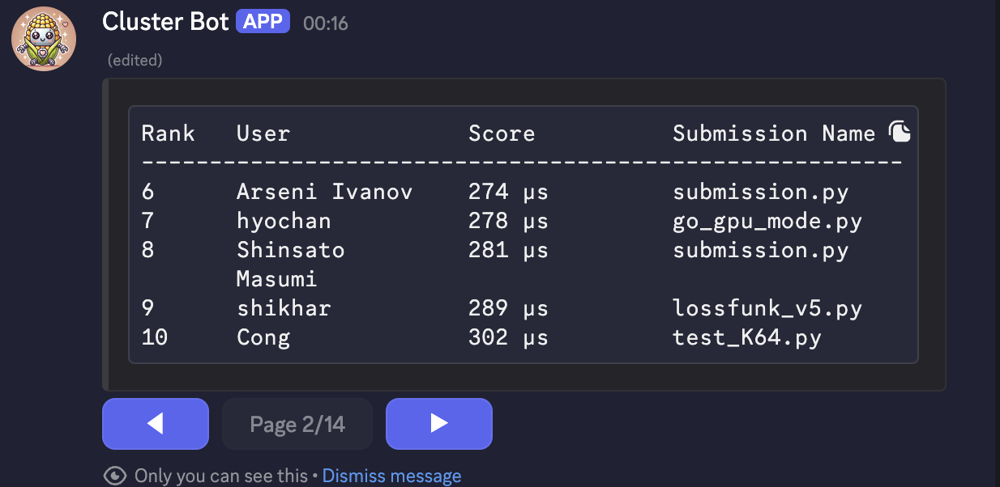

---
## Weekly Execution Updates
---
### Shipped this Week
- Worked on the FP8-GEMM challenge. Used triton and HIP for the most part.
- And the jump was a generous 70%~, from 800microseconds to 289microseconds.

- Also a WIP [repo](https://github.com/Itssshikhar/TorchFuser) is out. Making a lot of changes at the moment. It is still going to take some time to launch.
---
### Something Deep that I learned
- Other than `torch.compile()`, there are some other compilers that are solving this like `Triton` (uses LLVM), `MLC-llm` (uses Apache TVM) and `Modular MAX` (Mojo + MLIR). But no one is using `MLIR` for python (up for grabs, i guess).
- Another interesting bit is that `Triton`, by default, stores tensors in Shared Memory as `tiles`. Hence, it is able to execute the code faster out of the box.
- `HIP` (Heterogenous Interface for Programming) used by `AMD`, is pretty slow and there exist close to none reference code when compared with `cutLASS`. So, you are a lone ranger in this land.
---
### External Validation and Blockers
- Didn't do reach outs this week, but the plan today itself, is to make a workflow and post it on [Pytorch Dev forums](https://dev-discuss.pytorch.org/), for discussion with the pytorch team and other folks.
- Since making a compiler takes time (a lot), I want to be able to quickly get a small part of it to get launched (in the least possible time), so that with community feedback, it's easier to keep iterating on it and steer it.
---
### Monthly Reflection/This Week's focus
- Starting at Day-1 with the idea felt like climbing a mountain without having done so before. Today, even though it still is a mountain, I've got a lot more clarity, enough to execute some it and rest will be even more clear over the iterations
- There's one way to faster next month, is by executing and getting feedback from the community.
- Somewhat happy with the progress, could've done better, with more reachouts.