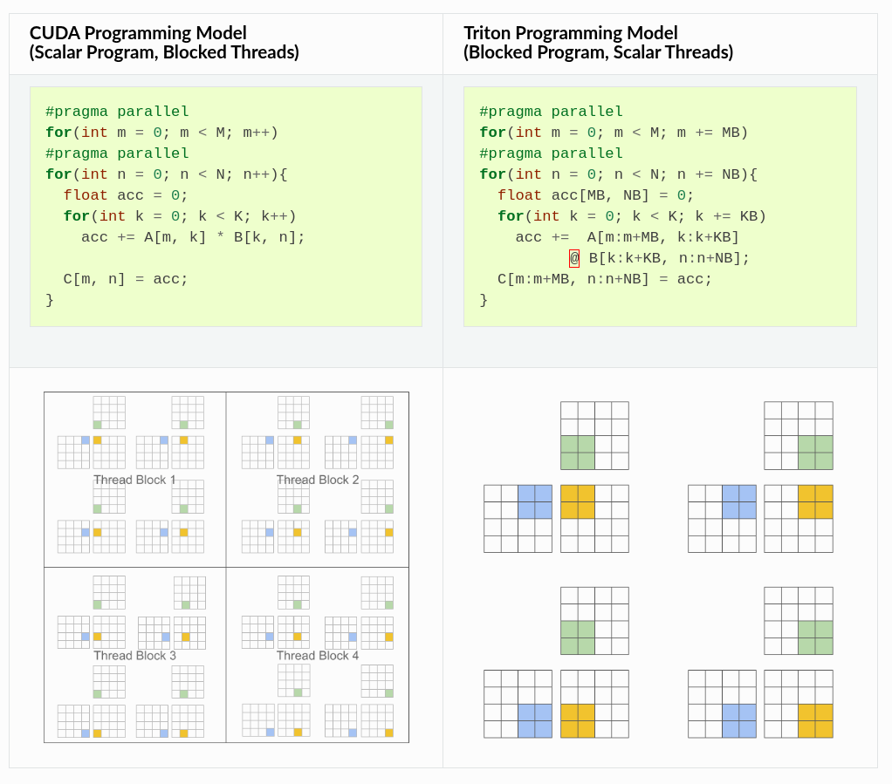

---
## Weekly Execution Updates

For this week, I was working on compiler designs in general and followed up with deep diving into MLIR and Triton's design choice (how it became what it is now).

--- 
### Shipped this Week

- Notes on _block-level data-flow analysis_ that is heavily used by Triton, for work-scheduling on data blocks, i.e., how the work done by each program should be partitioned for efficient execution on GPUs
- Read the [MLIR](https://arxiv.org/abs/2002.11054) paper to understand exactly where did MLIR come from, it's design principles, higher-level semantics and IR (Intermediate Representation) infrastructure (notes scribbled on the paper).

---
### Something Fundamental that I learned

Understanding how Triton is able to achieve the speed-up

1. Traditional _polyhedral compilers_ excel at dense, regular computations but struggle with sparse workloads due to their requirement for _affine functions_ in loop bounds and array subscripts.
```
for (i = 0; i < rows; i++)
  for (j = row_ptr[i]; j < row_ptr[i+1]; j++)
    y[i] += val[j] * x[col_idx[j]];
```

2. _Scheduling languages_ (like **Halide/TVM**) provide clean separation between algorithm and implementation but impose constraints on how loops can reference surrounding indices.
```
input(x-1,y) + input(x+1,y) // Only way to work with. Fixed offsets.

input(x, y + x) // Not with dynamically computed indices. Runtime condition
```

3. Triton's approach using _block-level data-flow analysis_ and _SPMD_ (Single Program, Multiple Data) programming offers promising advantages for GPU optimization with more flexible work scheduling, e.g., All delivery drivers (GPU threads) run the _same set of instructions_ but on _different data_ (e.g., different orders).




---
### External Validation and Blockers

- Need more hands-on experience applying these concepts to actual codebases
- Still building intuition for when to apply which optimization technique.
- A technical workflow of TorchFuser is out on Pytorch [Dev-Forums](https://dev-discuss.pytorch.org/t/torchfuser-a-plug-and-play-mlir-based-compiler-and-optimized-runtime-integration/2972)Can use this to explain the idea better when doing reach outs.
---
### Next Week's focus

1. Implement a small example using MLIR to solidify understanding of its core concepts.