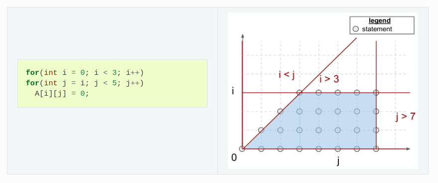
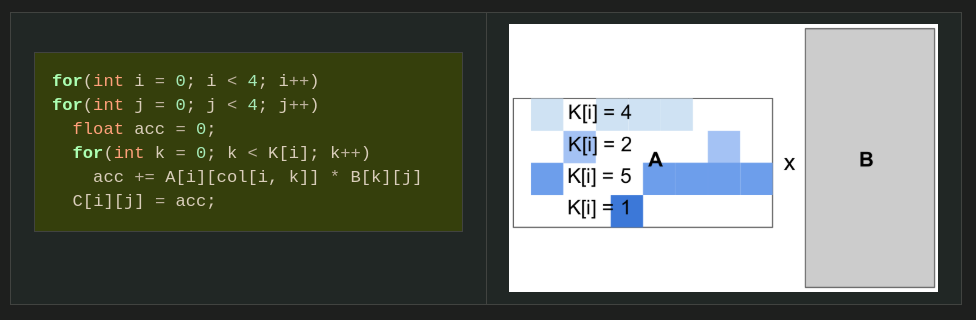

## Intro
- Starting with MLIR, along with python.
- The tension between the computational opportunities offered by DNNs and the practical difficulty of GPU programming has created substantial academic and industrial interest for ==Domain-Specific Languages (DSLs)== and ==compilers==. Regrettably, these systems – whether they be based on ==polyhedral machinery== (e.g., [Tiramisu](https://arxiv.org/pdf/1804.10694), [Tensor Comprehensions](https://arxiv.org/pdf/1802.04730) or scheduling languages (e.g., [Halide](https://people.csail.mit.edu/jrk/halide-pldi13.pdf), [TVM](https://www.usenix.org/system/files/osdi18-chen.pdf) – remain less flexible and (for the same algorithm) markedly slower than the best handwritten compute kernels available in libraries like [cuBLAS](https://docs.nvidia.com/cuda/cublas/index.html), [cuDNN](https://docs.nvidia.com/deeplearning/cudnn/api/index.html) or [TensorRT](https://docs.nvidia.com/deeplearning/tensorrt/developer-guide/index.html).
- Triton follows the programming paradigms based on ==blocked algorithms== [Lam-1991](https://www.computer.org/csdl/proceedings-article/hpcasia/1997/79010012/12OmNy5hRkV) can facilitate the construction of high-performance compute kernels for neural networks.
- Triton specifically revisit traditional ==“Single Program, Multiple Data”== [Auguin-1983](https://sci-hub.se/https://ieeexplore.ieee.org/document/28259) execution models for GPUs, and propose a variant in which programs – rather than threads – are blocked.
- A key benefit of this approach is that it leads to ==block-structured iteration== spaces that offer programmers more flexibility than existing DSLs when implementing sparse operations, all while allowing compilers to aggressively optimize programs for data locality and parallelism.
- The main challenge posed by our proposed paradigm is that of ==work scheduling==, i.e., how the work done by each program instance should be partitioned for efficient execution on modern GPUs.
- To address this issue, the Triton compiler makes heavy use of _block-level data-flow analysis_, a technique for scheduling iteration blocks statically based on the control- and data-flow structure of the target program.
- This compiler manages to apply a broad range of interesting optimization automatically ==(e.g., automatic coalescing, thread swizzling, pre-fetching, automatic vectorization, tensor core-aware instruction selection, shared memory allocation/synchronization, asynchronous copy scheduling).==

## Polyhedral Compilation
- Traditional compilers typically rely on intermediate representations, such as [LLVM-IR](https://llvm.org/pubs/2003-09-30-LifelongOptimizationTR.pdf), that encode control flow information using (un)conditional branches. This relatively low-level format makes it difficult to statically analyze the runtime behavior (e.g., cache misses) of input programs, and to automatically optimize loops accordingly through the use of [tiling](https://dl.acm.org/doi/pdf/10.1145/76263.76337), [fusion](https://citeseerx.ist.psu.edu/document?repid=rep1&type=pdf&doi=06f74a547501709de94d2a204b6e1abb1c084bbb) and [interchange](https://dl.acm.org/doi/pdf/10.1145/502874.502897). To solve this issue, [polyhedral compilers](https://dl.acm.org/doi/pdf/10.1145/109625.109631) rely on program representations that have statically predictable control flow, thereby enabling aggressive compile-time program transformations for data locality and parallelism. Though this strategy has been adopted by many languages and compilers for DNNs such as Tiramisu, Tensor Comprehensions, [Diesel](https://www.researchgate.net/publication/325639900_Diesel_DSL_for_linear_algebra_and_neural_net_computations_on_GPUs) and the [Affine dialect in MLIR](https://arxiv.org/pdf/2002.11054), it also comes with a number of limitations.

### Program Representation
- Polyhedral compilers focus on a class of programs commonly known as _Static Control Parts_ (SCoP)[^2], i.e., maximal sets of consecutive statements in which conditionals and loop bounds are affine functions of surrounding loop indices and global invariant parameters[^1].
- As shown above, programs in this format always lead to ==iteration domains== that are ==bounded by affine inequalities==, i.e., ==polyhedral==. These polyhedra can also be defined algebraically; for the above example:


$$
\begin{split}\mathcal{P} = \{ i, j \in \mathbb{Z}^2
~|~
\begin{pmatrix}
1 & 0 \\
-1 & 0 \\
-1 & 1 \\
0 & -1 \\
\end{pmatrix}
\begin{pmatrix}
i \\
j
\end{pmatrix}
+
\begin{pmatrix}
0 \\
2 \\
0 \\
4
\end{pmatrix}
\geq
0
\}\end{split}
$$

- Each point (i,j) in P represents a _polyhedral statement_, that is a program statement which ==(1) does not induce control-flow side effects== (e.g., `for`, `if`, `break`) and (2) ==contains only affine functions of loop indices and global parameters in array accesses==.
- To facilitate alias analysis, ==array accesses are also mathematically abstracted==, using so-called _access function_. In other words, `A[i][j]` is simply `A[f(i,j)]` where the access function f is defined by:
$$
\begin{split}f(i, j) = \begin{pmatrix}
1 & 0\\
0 & 1\\
\end{pmatrix}
\begin{pmatrix}
i\\
j
\end{pmatrix}
=
(i, j)\end{split}
$$
- Note that the iteration domains of an SCoP ==does not specify the order== in which its statements shall execute. In fact, this iteration domain ==may be traversed in many different possible legal orders==, i.e. _schedules_.
- Formally, a _schedule_ is defined as a ==p-dimensional affine transformation== _Θ_ of loop indices _x_ and global invariant parameters _g_:
$$
\begin{split}\Theta_S(\mathbf{x}) = T_S \begin{pmatrix}
\vec{x}\\
\vec{g}\\
1
\end{pmatrix}
\qquad
T_S \in \mathbb{Z} ^{p \times (\text{dim}(\mathbf{x}) + \text{dim}(\mathbf{g}) + 1)}\end{split}
$$
- Where _ΘS(x)_ is a ==p-dimensional vector== representing the ==slowest to fastest growing indices== (from left to right)[^3] when traversing the loop nest surrounding _S_.
- For the code shown above, the original _schedule_ defined by the loop nest in C-language can be retrieved by using:
$$
\begin{split}\Theta_S(\mathbf{x}) = \begin{pmatrix}
1 & 0 \\
0 & 1 \\
\end{pmatrix}
\begin{pmatrix}
i & j
\end{pmatrix}^T
=
\begin{pmatrix}
i & j
\end{pmatrix}^T\end{split}
$$
- where _i_ and _j_ are respectively the slowest and fastest growing loop indices in the nest. If _TS_ is ==a vector (resp. tensor)==, then _ΘS_ is a said to be ==one-dimensional (resp. multi-dimensional)==.

### Advantages
- Programs ==amenable to== _polyhedral compilation_ can be ==aggressively transformed and optimized==. Most of these transformations actually boil down to the ==production of schedules and iteration domains== that enable ==loop transformations== promoting _parallelism_ and _spatial/temporal data locality_ (e.g., _fusion_, _interchange_, _tiling_, _parallelization_).
- _Polyhedral compilers_ can also automatically go through complex verification processes to ensure that ==the semantics of their input program is preserved== throughout this optimization phase.
- Note that _polyhedral optimizers_ are ==not incompatible== with more standard optimization techniques.
- In fact, it is not uncommon for these systems to be implemented as a set of LLVM passes that can be run ahead of more traditional compilation techniques [Grosser-2012](https://www.infosun.fim.uni-passau.de/publications/docs/GGL2012ppl.pdf)
- All in all, _polyhedral machinery_ is extremely powerful, when applicable. It has been shown to support most common loop transformations, and has indeed ==achieved performance comparable to state-of-the-art GPU libraries== for dense matrix multiplication [Elango-2018-"Diesel"]. Additionally, it is also fully automatic and doesn’t require any hint from programmers apart from source-code in a C-like format.

### Limitations
- Unfortunately, _polyhedral compilers_ suffer from two major limitations that have prevented its adoption as a universal method for code generation in neural networks.
- First, the set of possible program transformations            _Ω={ΘS | S ∈ program}_ is large, and grows with the number of statements in the program as well as with the size of their iteration domain. 
- Verifying the legality of each transformation can also require the resolution of ==complex integer linear programs==, making _polyhedral compilation_ very ==computationally expensive==. 
- To make matters worse, hardware properties (e.g., _cache size_, _number of SMs_) and contextual characteristics (e.g., _input tensor shapes_) also have to be taken into account by this framework, leading to expensive auto-tuning procedures [Sato-2019](https://dl.acm.org/doi/pdf/10.1145/3293449)
- Second, the polyhedral framework is ==not very generally applicable==; _SCoPs_ are relatively common [Girbal-2006](https://icps.u-strasbg.fr/~bastoul/research/papers/GVBCPST06-IJPP.pdf) but require _loop bounds_ and _array subscripts_ to be ==affine functions of loop indices==, which typically only occurs in _regular, dense computations_.
- For this reason, this framework still has to be successfully applied to _sparse – or even structured-sparse_ – neural networks, whose importance has been rapidly rising over the past few years.
- ==On the other hand, _blocked program representations_ advocated by this dissertation are _less restricted in scope_ and can achieve close to peak performance using standard dataflow analysis.==

## Scheduling Languages
- **Separation of concerns** [Dijkstra-1982](https://www.cs.utexas.edu/~EWD/transcriptions/EWD04xx/EWD447.html) is a well-known design principle in computer science: ==programs should be decomposed into _modular layers of abstraction_== ==that separate the _semantics of their algorithms_ from _the details of their implementation_==. Systems like _Halide_ and _TVM_ push this philosophy one step further, and enforce this separation at _the grammatical level_ through the use of a **scheduling language**.
- The benefits of this methodology are particularly visible in the case of _matrix multiplication_, where, as one can see below, the definition of the algorithm (Line 1-7)[^4] is completely disjoint from its implementation (Line 8-16)[^5], meaning that both can be _maintained_, _optimized_ and _distributed independently_[^6].
```
 1 // algorithm
 2 Var x("x"), y("y");
 3 Func matmul("matmul");
 4 RDom k(0, matrix_size);
 5 RVar ki;
 6 matmul(x, y) = 0.0f;
 7 matmul(x, y) += A(k, y) * B(x, k);
 8 // schedule
 9 Var xi("xi"), xo("xo"), yo("yo"), yi("yo"), yii("yii"), xii("xii");
10 matmul.vectorize(x, 8);
11 matmul.update(0)
12    .split(x, x, xi, block_size).split(xi, xi, xii, 8)
13    .split(y, y, yi, block_size).split(yi, yi, yii, 4)
14    .split(k, k, ki, block_size)
15    .reorder(xii, yii, xi, ki, yi, k, x, y)
16    .parallel(y).vectorize(xii).unroll(xi).unroll(yii);
```

- The resulting code may however not be completely portable, as schedules can sometimes rely on ==execution models== (e.g., _SPMD_) or ==hardware intrinsics== (e.g., _matrix-multiply-accumulate_) that are not widely available. This issue can be mitigated by auto-scheduling mechanisms [Mullapudi-2016](https://dl.acm.org/doi/pdf/10.1145/2897824.2925952).

### Advantages
- The main advantage of this approach is that it allows programmers to _write an algorithm only once_, and focus on _performance optimization separately_. It makes it ==possible to manually specify optimizations== that a _polyhedral compiler_ ==wouldn’t be able to figure out automatically== using _static data-flow analysis_.
- **Scheduling languages** are, without a doubt, one of the most popular approaches for neural network code generation. The most popular system for this purpose is probably _TVM_, which provides good performance across a wide range of platforms as well as built-in automatic scheduling mechanisms.

### Limitations
- This ease-of-development comes at a cost. First of all, existing systems that follow this paradigm tend to be ==noticeably slower== than _Triton_ ==on modern hardware when applicable== (e.g., _V100/A100 tensor cores w/ equal tile sizes_).
- I do believe that this is not a fundamental issue of **scheduling languages** – in the sense that it could probably be solved with more efforts – ==but it could mean that these systems are harder to engineer==.
- More importantly, existing **scheduling languages** ==generate loops whose bounds and increments cannot depend on surrounding loop indices== without at least ==imposing severe constraints== on possible _schedules_ – if not breaking the system entirely.
- This is problematic for _sparse computations_, whose _iteration spaces may be irregular_.


- On the other hand, the _block-based program representation_ that we advocate for through this work allows for _block-structured iteration spaces_ and allows programmers to manually handle load-balancing as they wish.


[^1]: - "Maximal sets of consecutive statements" - This refers to the largest possible sequence of code statements that can be treated as a unit for optimization.
	1. "Conditionals and loop bounds are affine functions" - An affine function is a linear function plus a constant. So `f(x) = ax + b` is affine.
	2. "Surrounding loop indices and global invariant parameters" - This means that the loop bounds and conditional expressions only depend on:
	    - The indices of containing loops
	    - Global constants that don't change during program execution

	These techniques treat loops as geometric objects in a mathematical space, allowing powerful transformations like tiling, fusion, and parallelization.

	Example of code that fits this description:
	```
	for (i = 0; i < N; i++)
	  for (j = i; j < N+5; j++)
	    if (2*i + j < N)
	      A[i][j] = B[i][j] + C[i][j];
	```
	

[^2]: A Static Control Part (SCoP) is a fundamental concept in polyhedral compilation and program optimization. It represents a region of code with well-defined, predictable control flow that can be effectively analyzed and optimized.

[^3]: Kind of like saying that it is triple for-loop with top-most loop is the slowest to change and bottom-most loop is the fastest changing. 
	
	A schedule might transform this to prioritize different execution orders, like column-major instead of row-major traversal, or diagonal traversal for better locality.

[^4]: - `Var x("x"), y("y");` - Defines two variables that will be used as coordinates
	- `Func matmul("matmul");` - Defines a function called "matmul" that will compute the result
	- `RDom k(0, matrix_size);` - Creates a reduction domain for k from 0 to matrix_size
	- `RVar ki;` - Defines a reduction variable that will be used later in the schedule
	- `matmul(x, y) = 0.0f;` - Initializes all elements of the result matrix to 0
	- `matmul(x, y) += A(k, y) * B(x, k);` - Performs matrix multiplication by summing over k
	This is equivalent to computing:
	
	```
	for y = 0 to matrix_size-1:
	  for x = 0 to matrix_size-1:
	    matmul[x,y] = 0
	    for k = 0 to matrix_size-1:
	      matmul[x,y] += A[k,y] * B[x,k]
	```

[^5]: - Line 9: Defines variables for tiling and splitting loops
	- Line 10: Vectorizes the x dimension with a vector width of 8 for the initial step
	- Lines 11-16: Apply optimizations to the update step (the actual matrix multiplication):
	    - Line 12: Splits the x dimension into three nested loops (x, xi, xii) using block_size and 8
	    - Line 13: Splits the y dimension into three nested loops (y, yi, yii) using block_size and 4
	    - Line 14: Splits the k dimension into two nested loops (k, ki) using block_size
	    - Line 15: Reorders the loops for better memory access patterns and locality
	    - Line 16: Makes the outermost y loop parallel, vectorizes the innermost xii loop, and unrolls the xi and yii loops.

[^6]: Optimization Techniques Used
	
	1. **Tiling**: Breaks computation into blocks (via split operations) to improve cache utilization
	2. **Vectorization**: Utilizes SIMD instructions for parallel processing (8 elements at once)
	3. **Loop Reordering**: Changes the order of loops for better memory access patterns
	4. **Parallelization**: Distributes work across multiple cores or threads
	5. **Loop Unrolling**: Reduces loop overhead by executing multiple iterations in sequence
