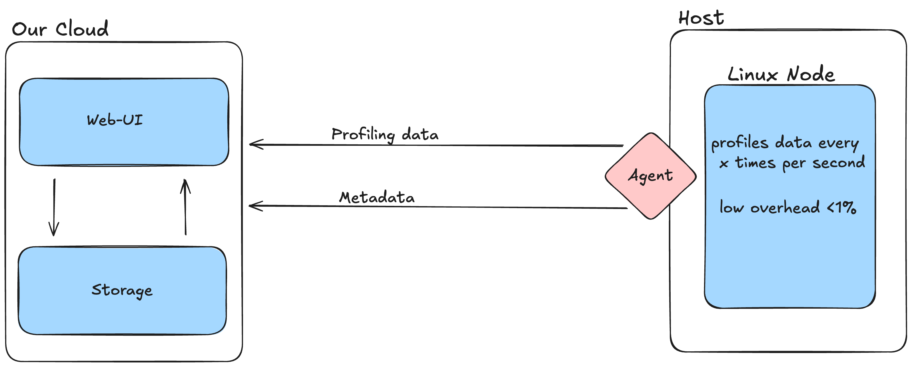
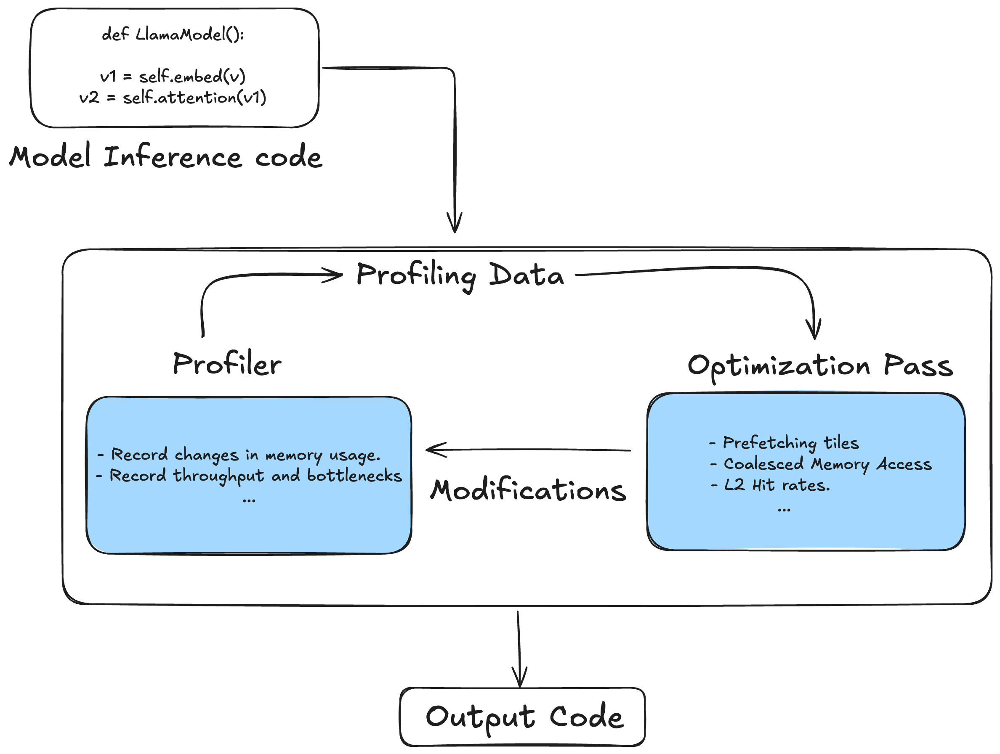
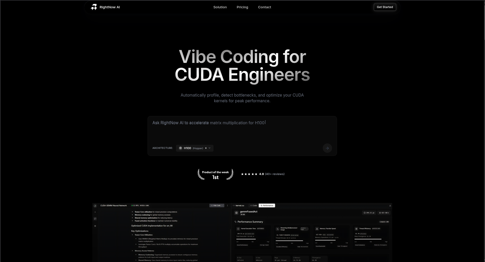
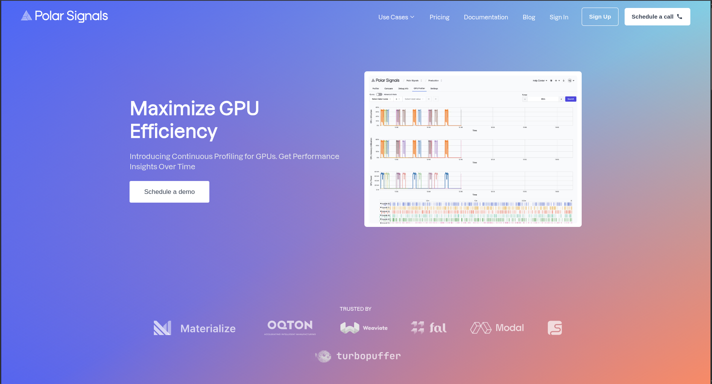

---
## Weekly Execution Updates

---
### Shipped/Worked on this Week

- Created an agent that would crawl the codebase and figure send the profiling back.

---

- Planned out continuous GPU profiling solution that can display bottlenecks easily in a Web-UI (kind of like W&B but for GPUs).

---
### Something Fundamental that I learned

- After taking to a bunch of people there is very less awareness about profiling and optimization.
- Even if someone has already launched your before you, they'll probably screw up. Most founders do. It boils down to execution and distribution.
- Having a deep chat with co-founder (distillation guy) is essential for startup to pan out.

---
### External Validation and Blockers

- Two other products just launched in the past 2-3 weeks, once again confirming the hypothesis.
- One is [this](https://www.rightnowai.co/)

- Other one is [this](https://www.polarsignals.com/use-cases/gpu-profiling)

---
### Next Week's Focus
- Getting an MVP out and reach out showing-casing that.